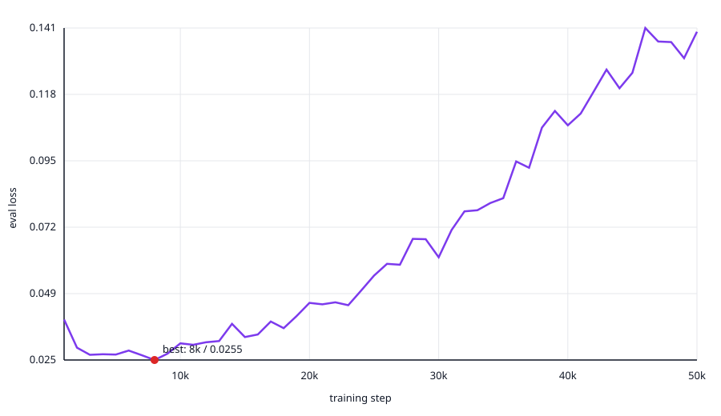
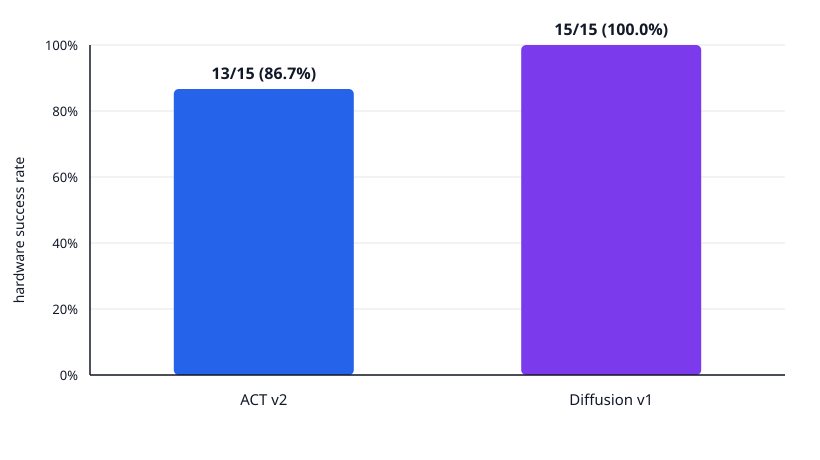

# SO-101 × LeRobot：双视角 Diffusion Policy 抓取放置

这个仓库完整记录一套 SO-101 Diffusion Policy 实验闭环：硬件检查、双摄像头采集、服务器训练、checkpoint 选择、推理加速、实机评测和失败恢复分析。

任务描述：`Pick up the yellow cable bundle and place it in the black target area.`

对应的 ACT 项目见 [so101-lerobot-project](https://github.com/li-clone/so101-lerobot-project)。

## 结果摘要

| 项目 | 结果 |
|---|---|
| 训练数据 | 70 episodes / 21,016 frames / 近中远 24:23:23 |
| 训练设置 | 50k steps / batch 16 / seed 1000 / 90:10 split |
| 最低验证损失 | 8k：0.0255（该步未保存） |
| 最佳已保存模型 | 5k：0.0274 |
| 部署参数 | `n_action_steps=32` / 10-step DDPM / 20 FPS |
| 实机结果 | 近 5/5、中 5/5、远 5/5，总计 **15/15（100%）** |





## ACT 与 Diffusion Policy 对比

两组实验共享 SO-101、手眼与第三视角双摄像头、640×480 输入、20 FPS、6 维关节状态与动作、70 条演示、50k 训练步、batch size 16、seed 1000，以及近/中/远各 5 次的实机评测结构。

| 对比项 | ACT v2 | Diffusion Policy v1 |
|---|---|---|
| 训练数据 | 70 episodes / 23,868 frames | 70 episodes / 21,016 frames |
| 核心模型 | CVAE + Transformer | 条件 1D U-Net + DDPM |
| 视觉编码 | 双视角 ResNet-18 | 双视角独立 ResNet-18 |
| 历史观测 | 1 帧 | 2 帧 |
| 可学习参数 | 51,597,190 | 277,819,846 |
| 状态/动作归一化 | Mean/Std | Min/Max |
| 优化器学习率 | `1e-5` | `1e-4` |
| 最佳已保存点 | 30k | 5k |
| 部署动作数 | `n_action_steps=50` | `n_action_steps=32` |
| 推理方式 | 一次前向生成动作块 | 10 次迭代去噪生成动作块 |
| 计算特征 | 延迟低，更接近目标控制频率 | 计算量更大，需减少去噪步数 |

### 实机结果

| 策略 | 近 | 中 | 远 | 总计 |
|---|---:|---:|---:|---:|
| ACT v2（30k） | 4/5 | 5/5 | 4/5 | 13/15（86.7%） |
| Diffusion v1（5k） | 5/5 | 5/5 | 5/5 | **15/15（100%）** |

Diffusion 的 15 次成功中，12 次首次抓取成功；近距离 episode 0、2 在首次失败后第二次抓取成功，远距离 episode 11 在第三次抓取成功。它展示了利用后续视觉观测自主回抓的能力。

本结果是本次两套相似视角、相同距离分布实验中的观察结果。两者训练数据并非同一数据集，摄像头机位也不是逐像素一致；每个策略只有 15 次实机试验。因此 `15/15` 与 `13/15` 不能推广为 Diffusion Policy 在一般任务上必然优于 ACT。不同策略的 eval loss 定义和尺度不同，也不能直接横向比较。

## 快速开始

```bash
git clone --recurse-submodules https://github.com/li-clone/so101-lerobot-diffusion-policy.git
cd so101-lerobot-diffusion-policy
git submodule update --init --recursive
test "$(git -C upstream/lerobot rev-parse HEAD)" = \
  "7e241bd630a3719a56157a497ce5d08f244784f1"
```

环境安装见 [环境配置](docs/environment_setup.md)。实际运行前复制硬件配置示例，并把占位设备路径替换为本机稳定路径；不要提交真实端口、校准文件或凭据。

## 文档导航

- [环境配置](docs/environment_setup.md)
- [硬件、标定与双摄像头](docs/hardware_and_cameras.md)
- [70 条数据采集](docs/data_collection.md)
- [Diffusion 训练与模型选择](docs/training.md)
- [推理优化与实机评测](docs/deployment_and_evaluation.md)
- [完整实验结果](docs/results.md)
- [故障排查](docs/troubleshooting.md)
- [数据与模型清单](docs/artifacts.md)

## 安全警告

第一次加载模型只能做短时 rollout。清空机械臂运动范围，准备随时按 `Ctrl+C` 和切断 Follower 12 V 电源。异常退出后必须确认六个电机的 `Torque_Enable=0`；无法确认时立即断电，不要强扭仍处于使能状态的关节。

## 数据与许可证

GitHub 仓库不包含原始数据、模型权重、完整训练日志、校准文件或原始视频。公开元数据、结果 CSV 和 SHA-256 清单位于 `manifests/` 与 `results/`。自有代码采用 [MIT License](LICENSE)，LeRobot 及其他第三方内容适用其各自许可证。
